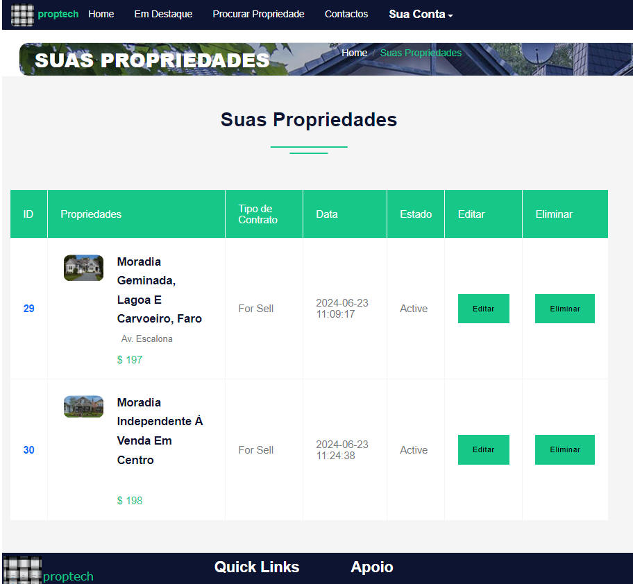

# proptech

Scripted for small to medium size real estate agencies.

forked from:
https://github.com/suraj25809/Real-Estate-Php

changes made include:
- added Portuguese and Spanish language strings
- using later version of bootstrap and added primer
- modified property adding and editing

general script purging and cleanup on todo list.
......

screen-shots:

admin section:

 
&nbsp;

# Requi rements

    PHP >= 5;
    PDO PHP Extension;
    GD PHP extension
    MySQL >= 5.7;

# Installation

    Modify config.php file
    $con = mysqli_connect("server_name","user_name","password","Database_name");
    Import the Database in Your Server like Xampp, Wamp
    Database Name -: developer

